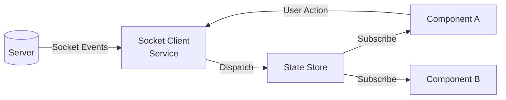

# State Store Design

> How the frontend manages state and connects to sockets.

## Goals
- Single source of truth for game state on the client
- Socket events flow into the store — components read from store
- No scattered socket listeners in components

## Proposed Architecture

## Responsibilities
- **Socket Client Service** — connect, disconnect, emit events, listen, reconnect logic
- **State Store** — holds game state, updates from socket events, exposes selectors
- **Components** — only know about the store, never touch sockets directly

## Tech Considerations
- React Context? Zustand? Redux? (check what's already used)
- Should use existing patterns in the codebase

## Related
- [[Frontend: New State Store Integration]]
- [[Socket Event Catalog]]
