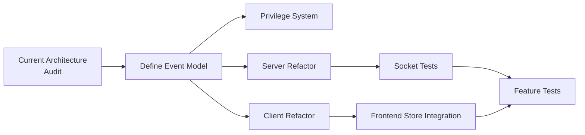

# Socket Refactor Master Plan

## Goal
Revamp all socket code to be approachable, maintainable, and not scattered across the codebase.

## Principles
- One source of truth for socket event handling
- Clear separation: server logic vs. transport (socket)
- Every socket event has a defined purpose, privilege, and test

---

## Known Work Items

- [[Frontend: New State Store Integration]]
- [[Remove Old Socket Code]]
- [[Refactor Client Socket Code]]
- [[Define Socket Event Mental Model]]
- [[Socket Privilege System]]
- [[Socket Tests]]
- [[Feature Tests]] *(deferred — should have been done first)*

## Dependencies

## Status
**Phase:** Exploration — auditing current code, documenting unknowns.

See [[Phases]] for execution order.
See [[Unknowns & Questions]] for open items.
See [[Decision Log]] for decisions made along the way.
